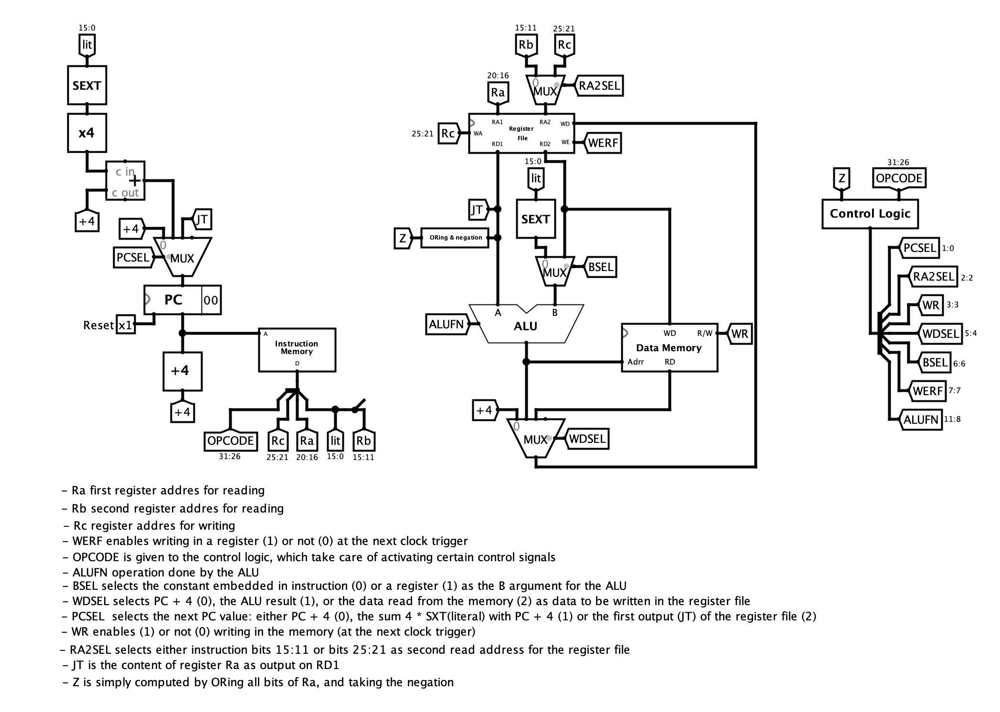
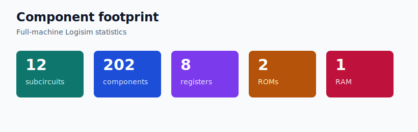

# Beta Machine in Logisim

A working 32-bit computer built from digital logic in Logisim.

## Project Overview

This repository contains a complete Logisim implementation of a Beta-machine datapath, including a 32-bit ALU, register file, instruction ROM, data RAM, control ROM, branching, load/store support, and a factorial validation program. The circuit is organized as reusable subcircuits and is backed by a generated control ROM plus a compiled Beta assembly test image.

## Repository Structure

```text
.
├── .gitignore
├── README.md
├── circuits/
│   └── beta_machine.circ
├── roms/
│   └── control_logic
├── programs/
│   ├── factorial_test.basm
│   └── factorial_test.basm.logisim-contents
├── scripts/
│   ├── ExportLogisimCircuit.java
│   ├── export_beta_machine_png.sh
│   ├── export_circuit_pngs.sh
│   └── load_control_logic.py
├── tools/
│   ├── logisim.jar
│   └── bsim-logisimexport.jar
├── assets/
│   ├── beta-machine.png
│   ├── circuits/
│   └── component-footprint.svg
└── docs/
    └── test-program.md
```

## Results Summary



The machine shown above is assembled from reusable Logisim components (whose exported views can be consulted in [assets/circuits/](assets/circuits/)): a program counter, instruction memory, register file, ALU, data memory, control logic, and the routing needed to drive the Beta control signals. The component footprint below summarizes the size of the final design, including its subcircuits, recursive component count, stateful registers, ROMs, and RAM.



To validate that the Beta machine executes programs correctly, the repository includes a factorial test program that stores input `3` in memory and writes the expected result, `6`, to `memory[4]`.

## Quick Start

Open the machine in Logisim:

```bash
java -jar tools/logisim.jar circuits/beta_machine.circ
```

Regenerate the control ROM:

```bash
python3 scripts/load_control_logic.py
```

Regenerate the README screenshot:

```bash
scripts/export_beta_machine_png.sh
```

Regenerate the subcircuit image gallery:

```bash
scripts/export_circuit_pngs.sh
```

If the old Logisim GUI has issues on Java 21, use Java 8 or 11 for interactive editing. The headless checks and screenshot export are designed to run without the GUI.
